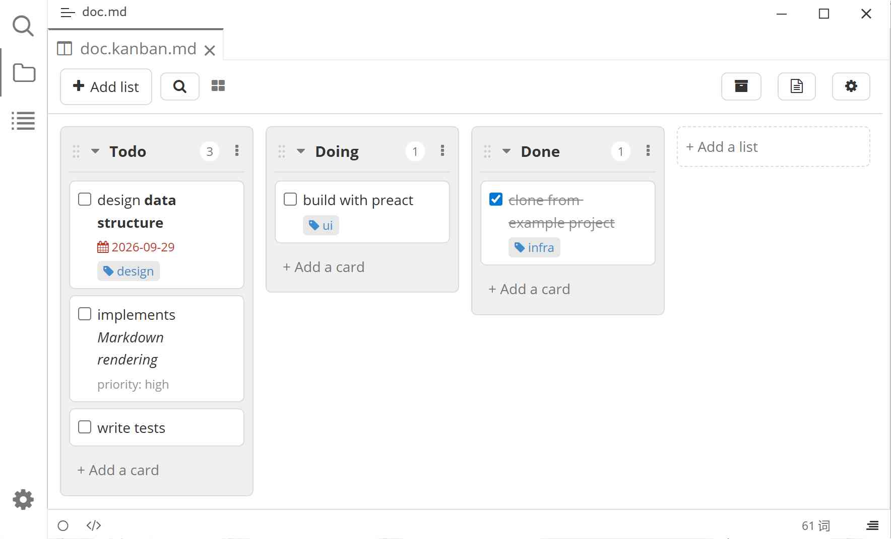

# Typora Plugin Kanban

English | [中文](./README.zh-CN.md)

This is a plugin based on [typora-community-plugin][core] for [Typora](https://typora.io). Inspired by [obsidian-kanban](https://github.com/community-archive/obsidian-kanban).

Render Markdown files as an interactive Kanban board: `##` headings become lists and `- [ ]` items become draggable cards — add, rename, reorder, archive and search without leaving Markdown, since every change is written straight back to the file.

## Preview



## Features

- **Markdown as the single source of truth** — a file with `kanban-plugin` frontmatter opens as a board.
- **Views** — board, list and table layouts, switchable from the toolbar or the command panel.
- **Lanes & cards** — create, rename, delete, duplicate, split and archive.
- **Drag & drop** — reorder cards within or across lists, and reorder lists.
- **Checkboxes** — completion state, with propagation into "done" lists.
- **Archive** — manual or bulk archiving, optional date stamps and a size limit.
- **Search** — filter lists and cards in place, with highlighted matches.
- **Dates & tags** — relative dates, overdue/upcoming highlighting, tag colors and sorting.
- **Settings** — global defaults plus per-board overrides.
- **i18n** — English and Simplified Chinese.

## Usage

Add `kanban-plugin` to a file's frontmatter, then run **Kanban: Open as Kanban Board** from the command panel (<kbd>F1</kbd>):

````markdown
---
kanban-plugin: board
---

## Todo

- [ ] Write the parser #dev [priority:: high] @2024-01-01

## Done

- [x] Set up the project
````

- A `## Heading` starts a new list.
- `- [ ]` / `- [x]` is a card; checkbox state is kept in sync.
- `#tag`, `[key:: value]` (or `(key:: value)`) and `@YYYY-MM-DD` (optionally with `HH:mm`) are parsed automatically.

## Commands

| Command | Description |
|---|---|
| Open as Kanban Board | Switch the active file to the board view. |
| Toggle Kanban Board | Switch between the board and Markdown views. |
| Create New Kanban Board | Create a new board file. |
| Archive Completed Cards | Move all completed cards to the archive. |
| Add Kanban List | Add a new list to the current board. |
| Open Board Settings | Edit settings for the current board. |
| Search Cards | Reveal the search box. |

## Install

1. Install [typora-community-plugin][core]
2. Open "Settings -> Plugin Marketplace" search "Kanban" then install it.

## Development

```bash
pnpm install
pnpm run build:dev   # esbuild dev build, installs into Typora
pnpm run build       # rollup release build
pnpm run pack        # produce plugin.zip
```

## License

MIT

[core]: https://github.com/typora-community-plugin/typora-community-plugin
